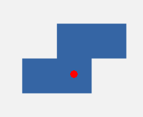

[Zurück](ComplexState.md)

---

# Elfte Aufgabe

Erweitern Sie das Programm `Block.elm` so, dass Sie das Quadrat mit den Pfeiltasten nach links und rechts bewegen können.
Die `Event`s für diese Pfeiltasten heißen `Left` und `Right`.
Bei jedem Schritt soll der Block dabei um `20` Pixel bewegt werden.
Ersetzen Sie das Quadrat außerdem durch einen Block mit dem folgenden Aussehen.

Als nächstes sollen Sie den gezeichneten Block mit Hilfe der Pfeil-Nach-Oben-Taste um 90 Grad drehen.
Das `Event` für die Pfeil-Nach-Oben-Taste lautet `Up`.
Ein Teilbild kann mit Hilfe von `image |> rotate rad` gegen den Uhrzeigersinn um seinen Mittelpunkt rotiert werden, wobei `rad` ein Winkel in Radiant ist.
In Elm gibt es eine Konstante `pi`, die Sie zur Berechnung der Rotation nutzen können.
Der rote Punkt auf dem Block definiert den Punk, um den der Block gedreht wird.
Überlegen Sie sich, wie Sie die Transformation definieren müssen, damit der Block um diesen Punkt rotiert wird.

Um den Block zu drehen, benötigen wir einen Zustand, der zusätzliche Informationen enthält.
Genauer gesagt, müssen Sie wissen, um wie viel Grad Ihr Block aktuell gedreht ist.
Erweitern Sie das Paar zu einem Tripel.
Die dritte Komponente gibt an, um wie viel Grad der Block gedreht ist.
Überlegen Sie sich, wie die Gradzahl geändert werden muss, wenn die Pfeil-Nach-Oben-Taste gedrückt wird.

---

[Zur zwölften Aufgabe](DataTypes.md)
