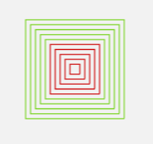

[Zurück](Styles.md)

---

# Dritte Aufgabe

Passen Sie die Datei `ColoredSquares.elm` im Ordner `src` so an, dass von den zehn Quadraten die inneren fünf rot und die äußeren fünf grün sind.
Die Datei enthält den folgenden Code.

```elm
scene =
    group
        [ square 10
        , square 20
        , square 30
        , square 40
        , square 50
        , square 60
        , square 70
        , square 80
        , square 90
        , square 100
        ]


main =
    display scene
```

Das heißt, das Programm soll die folgende Anzeige erzeugen.



---

[Weiter](Functions.md)
