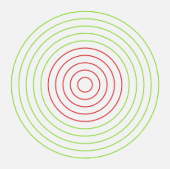

[Zurück](Re-Use.md)

---

# Dritte Aufgabe

Passe so an, dass von den 10 konzentrischen Kreisen die inneren fünf rot, die äußeren fünf grün sind:

```elm
form i =
  circle (10 * i)

scene _ _ =
  group
  [ form 1
  , form 2
  , form 3
  , form 4
  , form 5
  , form 6
  , form 7
  , form 8
  , form 9
  , form 10
  ]

main = display (400,300) scene Nothing
```

[share-elm](http://share-elm.com/sprout/54fcb943e4b0d720e25d602b)

Hinweise:

* Von den Funktionen `rectangle`, `square`, `circle`, `oval`, `path` gibt es Varianten, die uns das Aussehen der gezeichneten Linien verändern lassen.
  Während zum Beispiel `rectangle' (solid black) (30,20)` äquivalent zum schon gesehenen `rectangle (30,20)` ist, geht auch `rectangle' (dashed red) (30,20)`:  
    
  oder auch etwa `oval' (dotted blue) (30,20)`:  
    
  Eine Übersicht vorhandener Farben und Möglichkeiten zur Erzeugung neuer findet man bei Bedarf [hier](http://package.elm-lang.org/packages/elm-lang/core/latest/Color).

* Um abhängig von irgendeiner Bedingung verschiedene Ergebnisse (zum Beispiel einer Funktion wie `form i = ...`) zu liefern, lässt sich `if ... then ... else ...` verwenden.

Zielbild:



---

[Weiter](Maus.md)

