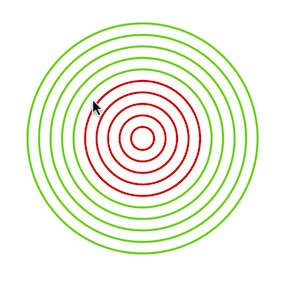

[Zurück](MousePosition.md)

---

# Sechste Aufgabe

Vervollständigen Sie nun die Datei `Mouse.elm` so, dass immer genau die Kreise rot sind, die näher am Koordinatenursprung sind als der Mauszeiger.
Alle anderen färben Sie grün.
Die Datei `Mouse.elm` enthält den folgenden Code.

```elm
pic ( x, y ) i =
    let
        r =
            10 * i
    in
    empty


scene ( x, y ) =
    group
        [ pic ( x, y ) 1
        , pic ( x, y ) 2
        , pic ( x, y ) 3
        , pic ( x, y ) 4
        , pic ( x, y ) 5
        , pic ( x, y ) 6
        , pic ( x, y ) 7
        , pic ( x, y ) 8
        , pic ( x, y ) 9
        , pic ( x, y ) 10
        ]


main =
    displayWithMouse scene
```

Das Programm soll die folgende Anzeige erzeugen.
Der Mauszeiger illustriert, dass die Kreise, die näher am Ursprung sind, rot gezeichnet werden, während die Kreise, die sich weiter außen befinden, grün gezeichnet werden.



Um die direkte Entfernung des Mauszeigers zum Ursprung zu berechnen, kann der Satz des Pythagoras verwendet werden.

---

[Zur siebten Aufgabe](Follow.md)
