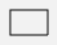

[Zurück](../README.md)

---

# Erste Aufgabe

In dieser Aufgabe sollen Sie die Datei `Nikolaus.elm` im Ordner `src` so vervollständigen, dass das Haus des Nikolaus gezeichnet wird.
Die Datei enthält den folgenden Code.

```elm
scene =
    group [ cross, rectangle ( 100, 130 ) ]


cross =
    segment ( -50, -65 ) ( 50, 65 )


main =
    display scene
```

Die Aufrufe `rectangle` und `segment` zeichnen Formen.

* `rectangle ( 30, 20 )`  
  führt zu:  
  

* `segment ( 0, 0 ) ( 30, 30 )`  
  führt zu:  
  

Mit `group` kann man mehrere Formen zu einer zusammenfassen.
Die Formen, die man zusammenfassen möchte, muss man dabei mit `[` und `]` umschließen und jeweils durch Kommata trennen.
Der Aufruf `display scene` zeichnet am Ende die Formen, die man definert hat.

Ändern Sie die Datei `Nikolaus.elm` so ab, dass eine Zeichnung der folgenden Art erzeugt wird.


Um den Code, der schon existiert, auszuprobieren, können Sie im Terminal `elm reactor` eingeben.
Öffnen Sie anschließend in einem Web-Browser die Seite `http://localhost:8000`.
Der Browser zeigt Ihnen nun die Verzeichnisstruktur dieses Projektes an.
Wählen Sie den Ordner `src` und anschließend die Datei `Nikolaus.elm`.
Nun sollten Sie sehen können, was die aktuelle Version der Datei `Nikolaus.elm` zeichnet.
Wenn Sie an der Datei `Nikolaus.elm` etwas geändert haben, können Sie einfach im Browser "Neu laden" wählen und der Browser zeigt, was die neue Implementierung zeichnet.


---

[Weiter](Forms.md)
