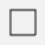
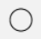
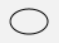
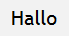

[Zurück](Nikolaus.md)

---

# Primitive Bilder

Wir haben schon gelernt, dass man mit `rectangle` und `segment` Bilder erzeugen kann.
Neben diesen Bildern, die wir bereits kennen, gibt es zum Beispiel noch die folgenden Bilder.

* `square 20`  
  führt zu:  
  

* `circle 10`  
  führt zu:  
  

* `ellipse ( 30, 20 )`  
  führt zu:  
  

* `text "Hallo"`  
  führt zu:  
  

Die Bilder werden (außer bei `segment`) immer um den Koordinatenursprung `( 0, 0 )` zentriert.
Um eine Form wie das Rechteck an einer anderen Stelle zu zeichnen, können Formen verschoben werden.
Ein Teilbild kann mit Hilfe von `image |> move ( x, y )` an eine beliebige Position verschoben werden. Dabei ist `image` das Bild, das verschoben wird, und `( x, y )` die Angabe, um wie viele Pixel das Bild in `x`- bzw. `y`-Richtung verschoben wird.

---

[Weiter](Re-Use.md)
