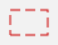

[Zurück](Re-Use.md)

---

# Stile

Von den Funktionen `rectangle`, `square`, `circle`, `ellipse`, `segment` gibt es Varianten, bei denen man den Stil der gezeichneten Linie angeben kann.
Der Aufruf `rectangle_ (solid black) ( 30, 20 )` erzeugt zum Beispiel das gleiche Bild wie `rectangle ( 30, 20 )`.
Der Aufruf `rectangle_ (dashed red) ( 30, 20 )` liefert dagegen das folgende Bild.

Entsprechend liefert der Aufruf `ellipse_ (dotted blue) ( 30, 20 )` das folgende Bild.

Die Farben `black`, `white`, `red`, `green`, `blue`, `yellow`, `orange`, `purple` und `brown` sind vordefiniert.
Mit der Funktion `rgb` können weitere Farben erzeugt werden.
Dabei erhält `rgb` die Werte für die drei Farben rot, grün und blau.
Die Werte müssen zwischen `0` und `255` liegen.
Der Aufruf `rgb 40 0 0` liefert zum Beispiel ein Rot.

---

[Zur dritten Aufgabe](ColoredSquares.md)
